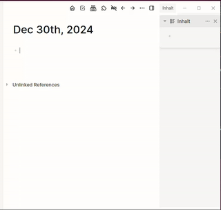

# LogSEQ SearX Search Plugin

This plugin integrates SearX/SearXNG meta search into LogSEQ, allowing you to search directly from your blocks.




## Features

- Search in different categories:
  - `/SearX Websites` - General web search
  - `/SearX News` - News search
  - `/SearX IT` - IT-related search
  - `/SearX Science` - Scientific search
  - `/SearX Files` - File search
  - `/SearX Social Media` - Social media search
- Configurable settings:
  - Custom SearX instance URL
  - Language preference
  - Time range for results
  - SafeSearch level
- Results are inserted as nested blocks with clickable links

## Installation

1. Go to LogSEQ Marketplace
2. Search for "SearX Search"
3. Click Install
4. Enable the plugin

## Configuration

1. Click the three dots (...) in LogSEQ's toolbar
2. Select "Plugins"
3. Find "SearX Search" and click the settings icon
4. Configure your preferred:
   - SearX Instance URL (default: https://search.corrently.cloud)
   - Language (e.g., en-US, de-DE)
   - Time Range (day, week, month, year)
   - SafeSearch Level (0: Off, 1: Moderate, 2: Strict)

## Usage

1. Create a new block with your search query
2. Use one of the slash commands:
   - Type `/SearX` to see all available search categories
   - Select the desired category
3. Results will be inserted as nested blocks under your query

## Development

1. Clone the repository
2. Install dependencies: `npm install`
3. Build the plugin: `npm run build`
4. Copy to LogSEQ plugins directory:
   ```bash
   mkdir -p ~/.logseq/plugins/logseq-searx-plugin
   cp -r index.html package.json dist ~/.logseq/plugins/logseq-searx-plugin/
   ```

## License

MIT

## Privacy Notice

This plugin sends search queries to your configured SearX instance. Make sure to use a trusted instance.